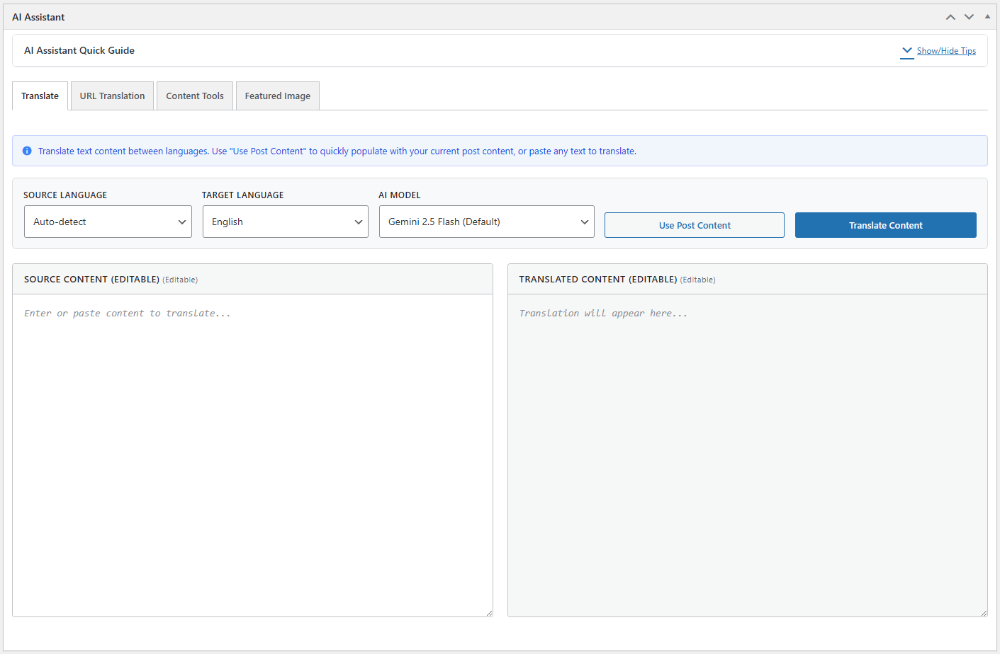
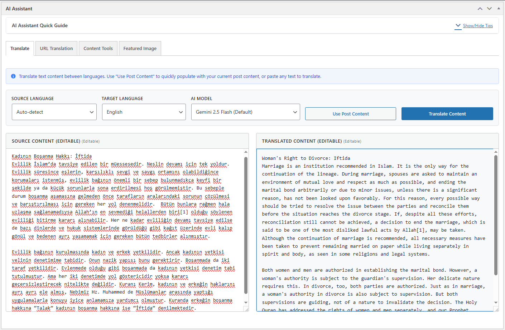
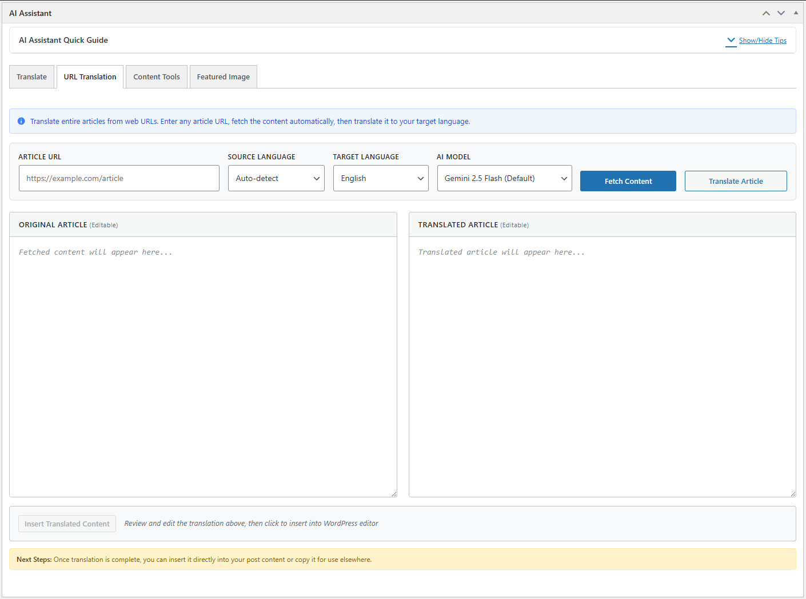
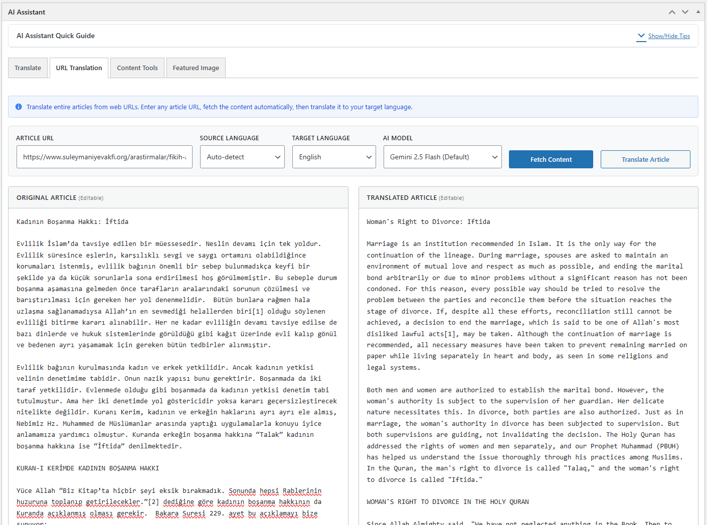
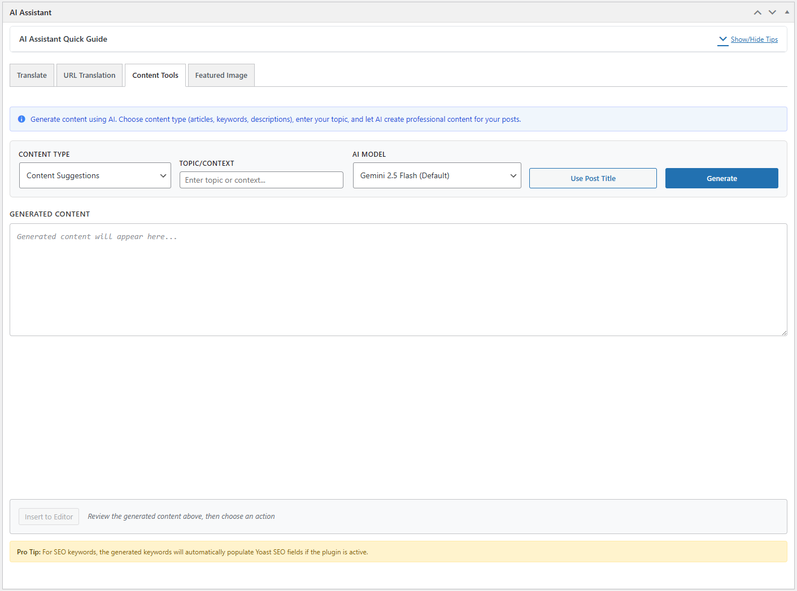
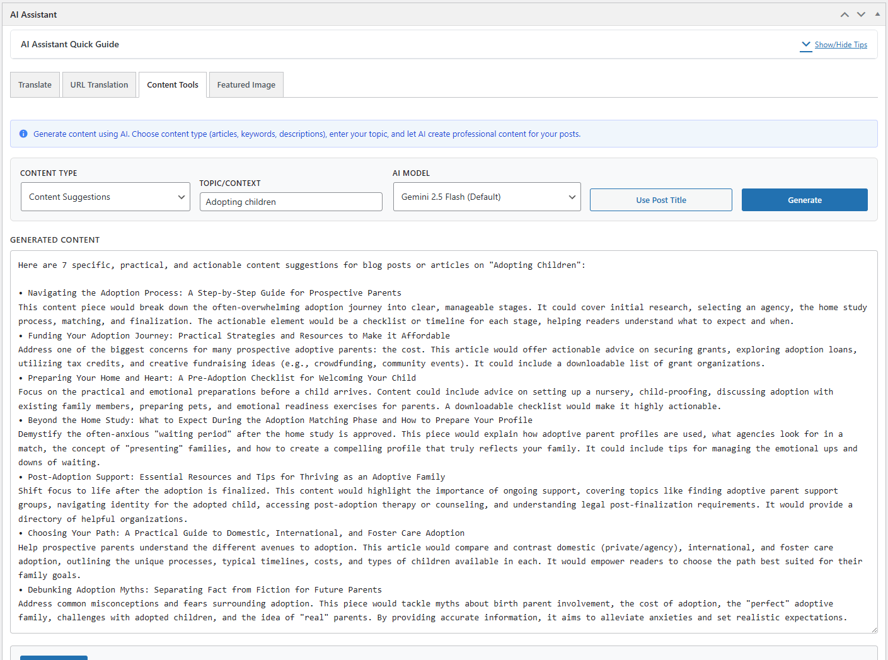
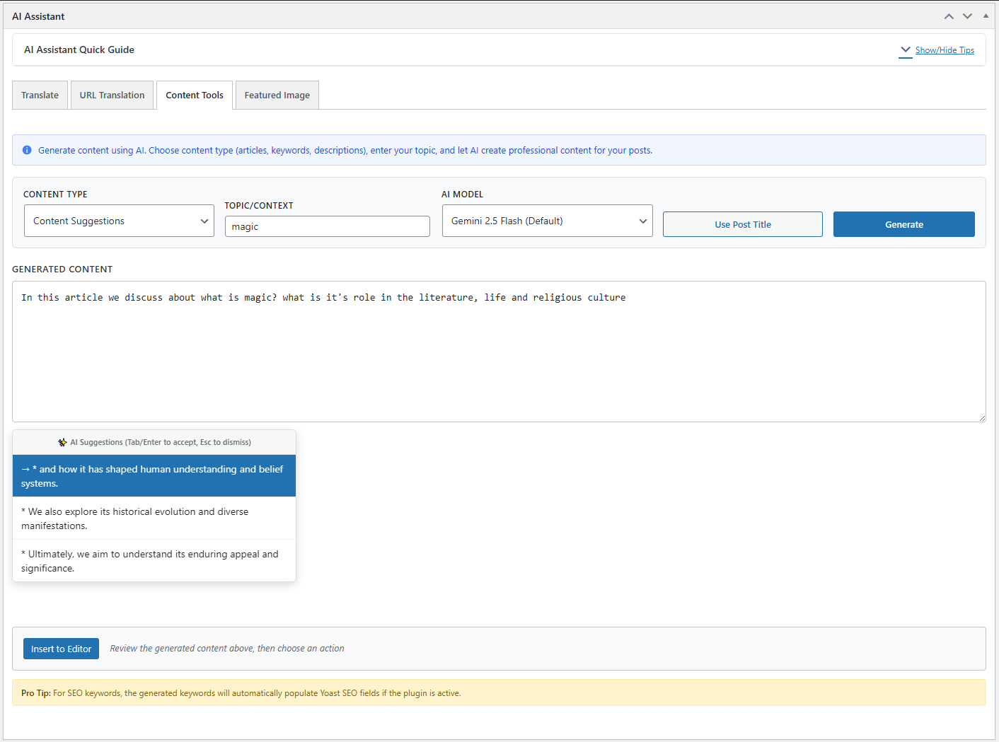
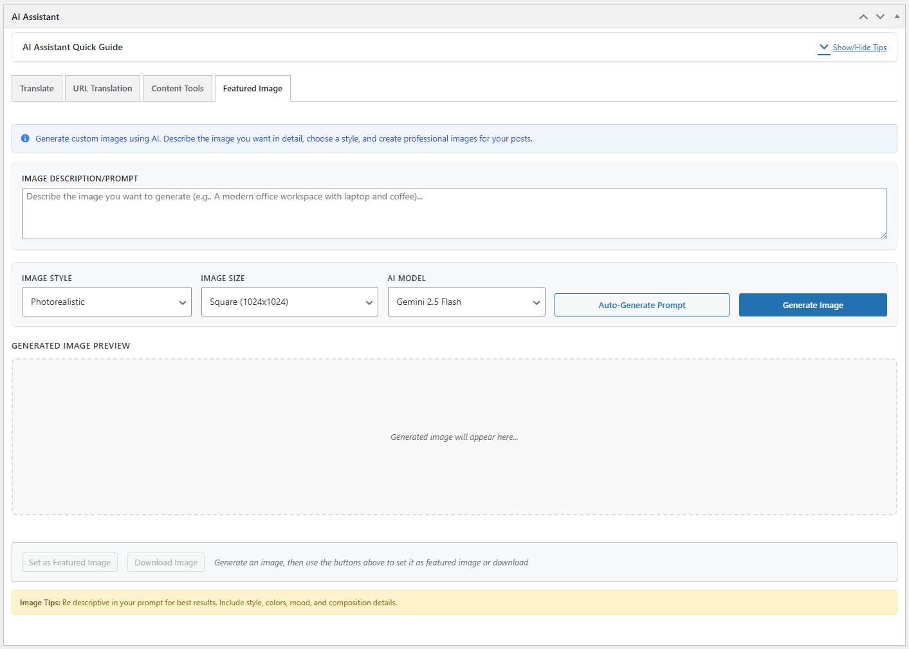
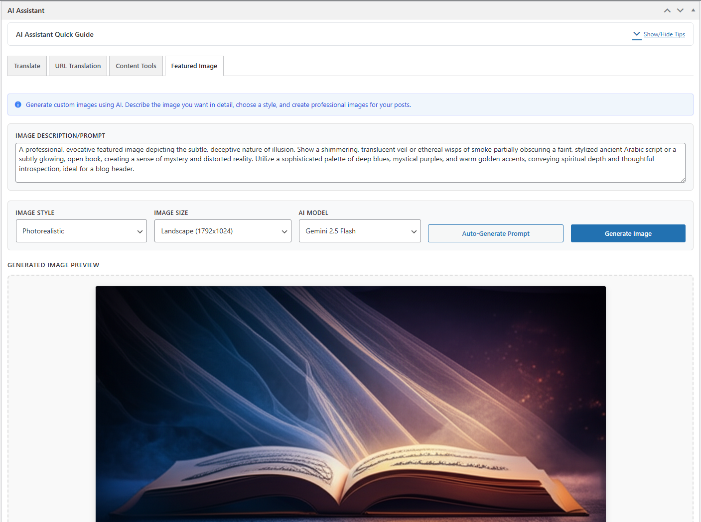

# AI Assistant for WordPress v1.0.58

🚀 **Professional AI-powered translation and content generation plugin for WordPress**

[](https://github.com/sunsiz/ai-assistant)
[](https://www.gnu.org/licenses/gpl-2.0.html)
[](https://wordpress.org)

## 🌟 What's New in v1.0.58

### 🔧 **Enhanced Features**
- **✅ Auto-Translation System**: Complete auto-translation functionality for interface strings in .po files
- **✅ Universal Language Detection**: Dynamic language code extraction for any locale format
- **✅ Individual Translation Buttons**: AI-powered translation for specific untranslated strings
- **✅ Centralized Logging**: Improved debugging with conditional log output

### 🌍 **Translation Management**
- **Bulk Auto-Translation**: Translate all empty interface strings with one click
- **Individual String Translation**: Target specific strings for AI translation
- **Visual Translation Editor**: Enhanced .po file editor with search and filtering
- **Real-time Status Updates**: Live translation progress and success indicators

### 🏗️ **Technical Improvements**
- **Production-Ready Codebase**: Zero syntax errors, optimized performance
- **Enhanced Error Handling**: Comprehensive AJAX error reporting and debugging
- **Improved Response Parsing**: Aggressive cleanup for clean translation output
- **Better User Experience**: Loading states, progress indicators, and user feedback

### 🌍 **Translation Updates**
- **Turkish (Türkçe)**: 418+ strings (100% complete) 🇹🇷
- **Chinese (中文)**: 419+ strings (100% complete) 🇨🇳  
- **Uyghur (ئۇيغۇرچە)**: 418+ strings (100% complete)
- **Arabic (العربية)**: Enhanced translation support 🇸🇦
- **Total**: 14+ languages with 5,900+ translated strings

A comprehensive AI-powered translation and content writing assistant plugin for multilingual WordPress websites.

## Features

### 🌐 Translation Capabilities
- **URL-based Translation**: Extract and translate content from any WordPress post URL
- **Direct Content Translation**: Translate text directly within the post editor
- **Auto Language Detection**: AI automatically detects source language
- **Side-by-side Editor**: Compare original and translated content in real-time
- **Post Metadata Translation**: Translate titles, excerpts, and custom fields
- **Bulk Translation**: Auto-translate all empty .po file strings for interface localization
- **Individual String Translation**: Target specific untranslated interface strings
- **Visual Translation Editor**: Enhanced .po file editor with search and filtering capabilities

### ✍️ Content Generation & Writing Assistant
- **AI Content Suggestions**: Generate article content based on titles and website context
- **SEO Content Optimization**: Create SEO-friendly content with keyword integration
- **Grammar and Style Enhancement**: Improve existing content for better readability
- **Tone Adjustment**: Modify content tone (professional, casual, academic, etc.)
- **Featured Image Generation**: Create AI-generated featured images using DALL-E 3
- **Custom Prompt System**: Personalize AI responses with custom prompts
- **Content Templates**: Pre-built templates for different content types

### ⚙️ Configuration & Management
- **Multi-Provider AI Support**: Configure OpenAI, Anthropic Claude, and Google Gemini APIs
- **Intelligent Provider Switching**: Automatic fallback between AI providers
- **User-Specific Language Settings**: Each user can set their own interface language
- **Translation History**: Complete audit trail of all translation activities
- **Content Suggestion History**: Track and review AI-generated content suggestions
- **API Usage Analytics**: Monitor API usage and costs across different providers
- **Diagnostics Dashboard**: Test API connections and troubleshoot issues
- **Auto-Translation System**: Bulk translate interface strings for plugin localization

### 🎨 User Interface & Experience
- **Post Editor Meta Box**: Integrated directly into WordPress post/page editor
- **Tabbed Interface**: Organized tabs for Translation, URL Translation, Content Tools, and Featured Images
- **Real-time Progress**: Live progress indicators and status updates
- **Responsive Design**: Fully responsive interface for all screen sizes
- **Accessibility Ready**: WCAG compliant with full keyboard navigation
- **Admin Dashboard**: Comprehensive management interface with statistics and history
- **Visual Feedback**: Loading states, success/error messages, and user guidance

## 📸 Screenshots & Examples

The AI Assistant plugin provides an intuitive and powerful interface integrated directly into the WordPress post editor. Here are examples of the main features in action:

### 🌐 Translation Tools

**Translation Tab Interface**


The Translation tab provides powerful multilingual capabilities with support for URL-based translation, direct content translation, and automatic language detection.

**Translation in Action**


Example showing the translation feature translating content from English to Turkish, with side-by-side comparison and real-time editing capabilities.

### 🌍 URL Translation Feature

**URL Translation Interface**


The URL Translation feature allows you to paste any post URL and automatically translate its content. Perfect for translating existing posts or content from other websites.

**URL Translation Example**


Live example showing URL-based translation in progress, with automatic content extraction and language detection.

### ✍️ Content Generation Tools

**Content Tools Interface**


The Content Tools tab provides AI-powered writing assistance including content suggestions, SEO optimization, grammar checking, and tone improvement.

**Content Generation Example**


Example demonstrating AI-generated content suggestions based on the article title, providing writers with creative inspiration and structured content ideas.

**Content Generation AI Suggestion Example**


Example demonstrating Live AI Suggestions based on topic/context and content of the editing area, while writing or editing content in Content Tool editing area.

### 🖼️ Featured Image Generation

**Featured Image Interface**


The Featured Image tab leverages AI to generate compelling featured images based on your content title and description.

**Featured Image Example**


Example showing AI-generated featured image creation with customizable prompts and instant preview capabilities.

## Supported Languages

**17 Fully Supported Interface Languages:**
- 🇺🇸 English (en_US) - Default
- 🇹🇷 Turkish (tr_TR) - 100% Complete (418+ strings)
- 🇨🇳 Chinese Simplified (zh_CN) - 100% Complete (419+ strings)
- ئۇيغۇرچە Uyghur (ug_CN) - 100% Complete (418+ strings)
- 🇸🇦 Arabic (ar) - Complete
- 🇮🇷 Persian/Farsi (fa_IR) - Complete
- 🇳🇱 Dutch (nl_NL) - Complete
- 🇩🇰 Danish (da_DK) - Complete
- 🇫🇷 French (fr_FR) - Complete
- 🇦🇿 Azerbaijani (az_AZ) - Complete
- 🇺🇿 Uzbek (uz_UZ) - Complete
- 🇰🇬 Kyrgyz (ky_KG) - Complete
- 🇷🇺 Russian (ru_RU) - Complete
- 🇵🇹 Portuguese (pt_PT) - Complete
- 🇪🇸 Spanish (es_ES) - Complete
- 🇩🇪 German (de_DE) - Complete
- 🇫🇮 Finnish (fi) - Complete
- 🇵🇰 Urdu (ur) - Complete
- Turkmen (tk) - Complete

**Total:** 5,900+ translated interface strings across 19 languages

## Supported AI Models

### Google Gemini (Primary)
- **Gemini 2.5 Flash** (Default) - Fast and efficient for most tasks
- **Gemini 2.5 Pro** - Advanced model for complex tasks
- **Gemini 1.5** - Legacy support

### OpenAI (Configurable)
- **GPT-4** - Premium model for highest quality
- **GPT-3.5 Turbo** - Fast and cost-effective

### Anthropic (Configurable)
- **Claude 4 Sonnet** - Latest high-performance model
- **Claude 4 Opus** - Most capable model for complex tasks

## Installation

1. **Download** the plugin files
2. **Upload** to your WordPress `/wp-content/plugins/` directory
3. **Activate** the plugin through the WordPress admin
4. **Configure** API keys in Settings > AI Assistant
5. **Start using** the AI blocks in your posts and pages

## Configuration

### 🔑 API Keys Setup

1. Navigate to **AI Assistant > Settings** in your WordPress admin
2. Configure your preferred AI provider API keys:
   - **Google Gemini**: Get from [Google AI Studio](https://makersuite.google.com/app/apikey)
   - **OpenAI**: Get from [OpenAI API Keys](https://platform.openai.com/api-keys)
   - **Anthropic**: Get from [Anthropic Console](https://console.anthropic.com/)

### 🌍 Language Settings

**Personal Language Selection:**
- Each user can set their own interface language in **AI Assistant > Settings**
- Language preferences are saved per user account
- Plugin language changes don't affect WordPress core or other users

### 🎯 Custom Prompts

Customize AI behavior for different tasks:
- **Translation Prompt**: Use `{source_language}` and `{target_language}` placeholders
- **Content Generation Prompt**: Customize how AI creates content suggestions
- **SEO Enhancement Prompt**: Tailor keyword generation and optimization
- **Image Generation Prompt**: Customize DALL-E or Gemini image creation prompts

## Usage

### 🌐 Translation Features

**Content Translation:**
1. Open any post/page in the WordPress editor
2. Locate the **AI Assistant** meta box below the editor
3. Click the **Translation** tab
4. Enter content or use existing post content
5. Select source and target languages
6. Choose your preferred AI model
7. Click **Translate** and review results
8. Edit translation as needed and **Populate to Editor**

**URL Translation:**
1. Click the **URL Translation** tab
2. Paste a WordPress post URL in the URL field
3. Click **Fetch Content** to extract the original content
4. Select target language for translation
5. Click **Translate Article** to process
6. Review and edit the translated content
7. **Insert Content** to add to your post

### ✍️ Content Generation

**AI Content Suggestions:**
1. Switch to the **Content Tools** tab
2. Enter your article title (or use **Use Post Title**)
3. Select content type (article, listicle, tutorial, etc.)
4. Choose AI model and content length
5. Click **Generate Content** for AI suggestions
6. Review generated content and **Insert Generated Content**

**SEO Enhancement:**
1. Select "SEO Keywords" from content type dropdown
2. Enter your target topic or keyword
3. Generate SEO-optimized content suggestions
4. **Apply Keywords** to integrate into your content

### 🖼️ Featured Image Generation

**AI Image Creation:**
1. Go to the **Featured Image** tab
2. Enter image description or click **Auto-Generate Prompt** will generate prompt from content
3. Customize the image prompt as needed
4. Select image style and dimensions
5. Click **Generate Image** to create with DALL-E 3
6. Review and set as featured image

## Development

### 📋 Prerequisites
- **WordPress**: 5.8 or higher
- **PHP**: 7.4 or higher
- **MySQL**: 5.6 or higher
- **AI API Keys**: At least one provider (Google Gemini recommended)

### 📁 Project Structure
```
ai-assistant/
├── ai-assistant.php              # Main plugin file
├── includes/                     # Core PHP classes
│   ├── class-admin.php          # Admin interface & AJAX handlers
│   ├── class-ai-service.php     # AI API integration
│   ├── class-content-analyzer.php # Content analysis utilities
│   ├── class-diagnostics.php   # API testing & diagnostics
│   ├── class-settings.php      # Settings management
│   └── class-translator.php    # Translation & history management
├── assets/                      # Frontend resources
│   ├── js/
│   │   ├── admin.js            # Admin interface JavaScript
│   │   └── editor.js           # Post editor meta box functionality
│   ├── css/
│   │   ├── admin.css           # Admin styling
│   │   └── editor.css          # Editor meta box styling
│   └── images/                 # Screenshots & assets
├── languages/                   # Translation files (.po/.mo)
│   ├── ai-assistant-*.po       # Translation source files
│   ├── ai-assistant-*.mo       # Compiled translation files
│   └── ai-assistant.pot        # Translation template
├── CHANGELOG.md                 # Version history
├── README.md                    # Documentation
└── readme.txt                  # WordPress.org plugin readme
```

### 🔧 Development Features
- **Auto-Translation System**: Bulk translate .po files for interface localization
- **Comprehensive Logging**: Debug mode with detailed error tracking
- **API Diagnostics**: Built-in API testing and connection verification
- **Database Management**: Automatic table creation and migration system
- **Caching System**: Intelligent caching for API responses and translations

## Hooks and Filters

### Actions
- `ai_assistant_translation_complete` - Fired after translation completion
- `ai_assistant_content_suggested` - Fired after content suggestion
- `ai_assistant_api_error` - Fired on API errors

### Filters
- `ai_assistant_supported_languages` - Modify supported languages
- `ai_assistant_available_models` - Modify available AI models
- `ai_assistant_default_prompts` - Modify default prompts

## 🛠️ Troubleshooting

### Common Issues & Solutions

**🌐 Language Change Not Working**
- **Error**: Select Admin Interface Language in the Language Settings area of plugin settings
- **Solution**:
  - Scroll to the bottom of the language selection page
  - Click **Compile All .mo Files** button
  - This will correct any language display issues

**🔑 API Key Problems**
- **Error**: "API key not configured" or authentication failures
- **Solution**: 
  - Verify API keys are entered correctly in **AI Assistant > Settings**
  - Check API key permissions and quotas with your provider
  - Test API connection using **AI Assistant > Diagnostics**
  - Ensure sufficient API credits/usage limits

**🌐 Translation Not Working**
- **Error**: "Translation request failed" or empty results
- **Solution**:
  - Check internet connection stability
  - Verify source content is not empty or too long
  - Try switching to a different AI model in settings
  - Enable debug mode to see detailed error logs
  - Check API provider status and rate limits

**📝 Content Generation Issues**
- **Error**: Empty or poor quality content suggestions
- **Solution**:
  - Ensure your website has published content for context
  - Try different, more specific article titles
  - Adjust content type and length settings
  - Verify AI model availability and performance

**🖼️ Featured Image Generation Problems**
- **Error**: Image generation fails or returns errors
- **Solution**:
  - Check OpenAI API key is configured (DALL-E 3 requirement)
  - Verify image prompts meet OpenAI content policy
  - Try simpler, more descriptive prompts
  - Check OpenAI usage limits and billing status

**🔧 Auto-Translation System Issues**
- **Error**: "Auto translate all empty strings" fails
- **Solution**:
  - Check .po file permissions and accessibility
  - Verify target language is properly configured
  - Enable debug logging to identify specific failures
  - Ensure sufficient server memory for bulk operations

### 🐛 Debug Mode

Enable comprehensive debugging:

**WordPress Debug Configuration:**
```php
// Add to wp-config.php
define('WP_DEBUG', true);
define('WP_DEBUG_LOG', true);
define('WP_DEBUG_DISPLAY', false);
```

**AI Assistant Debug Features:**
- Admin interface includes real-time error logging
- AJAX requests show detailed response information
- API diagnostic tools test connection and response quality
- Translation history tracks success/failure rates

### 📊 Performance Optimization

**API Response Caching:**
- Translations cached for 30 minutes to reduce API calls
- Content suggestions cached based on title and settings
- View diagnostics in **AI Assistant > Settings** if needed

**Large Content Handling:**
- Content automatically chunked for optimal API performance
- Long articles processed in segments for better accuracy
- Timeout handling prevents failed requests on slow connections

## Security

- All API keys are stored securely in WordPress options
- User capabilities are checked for all operations
- Nonce verification for all AJAX requests
- Content sanitization and validation
- SQL injection prevention

## Performance

- Efficient database queries with proper indexing
- Caching of AI responses where appropriate
- Async loading of non-critical resources
- Optimized for large content volumes

## Contributing

We welcome contributions to improve AI Assistant for WordPress!

**How to Contribute:**
1. 🍴 Fork the [repository](https://github.com/sunsiz/ai-assistant)
2. 🌟 Create a feature branch (`git checkout -b feature/amazing-feature`)
3. 💻 Make your changes with proper documentation
4. ✅ Add tests for new functionality
5. 📝 Update documentation as needed
6. 🚀 Submit a pull request with detailed description

**Contribution Areas:**
- 🌍 **Translations**: Help translate to new languages
- 🔧 **Bug Fixes**: Identify and fix issues
- ⚡ **Performance**: Optimize code and reduce resource usage
- 🎨 **UI/UX**: Improve user interface and experience
- 📚 **Documentation**: Enhance guides and examples

## 📈 Changelog

### Version 1.0.58 - Current Release
- ✅ **Auto-Translation System**: Complete auto-translation functionality for .po files
- ✅ **Enhanced Debugging**: Comprehensive error logging and AJAX debugging
- ✅ **Individual Translation**: AI-powered translation for specific interface strings
- ✅ **Production-Ready**: Zero syntax errors, optimized performance
- ✅ **Visual Documentation**: Enhanced README with feature screenshots

### Version 1.0.56
- 🔧 **Diagnostics Fixes**: Resolved HTTP 503 errors in API testing
- 🌍 **Turkish Translations**: Added missing user-specific language strings
- 🏗️ **API Optimization**: Lightweight testing endpoints for faster diagnostics
- 📊 **Translation Stats**: 14 languages, 5,846+ translated strings

### Version 1.0.55
- 🚀 **User-Specific Languages**: Individual language preferences per user
- 🔧 **Global Locale Fix**: Removed problematic WordPress locale filters
- 🌍 **Enhanced Translations**: Complete Chinese and Uyghur language support
- 🏗️ **Technical Improvements**: Refactored language loading system

### Version 1.0.54
- 🌍 **Complete Uyghur Translation**: 100% native language coverage
- 🔧 **API Message Translations**: Diagnostic terms in native languages
- 📊 **Quality Improvements**: Enhanced technical terminology translations

### Version 1.0.53
- 🌍 **Complete Chinese Translation**: 100% coverage for zh_CN
- 🚀 **Uyghur Implementation**: Comprehensive ug_CN translation
- 🔧 **Cultural Adaptation**: Linguistically accurate translations
- 🏗️ **Character Encoding**: Enhanced support for non-Latin scripts

For complete version history, see [CHANGELOG.md](CHANGELOG.md)

## 📞 Support & Contributing

### 🆘 Getting Help

**Documentation & Resources:**
1. 📖 Read this comprehensive README documentation
2. 🔍 Check the [Troubleshooting](#-troubleshooting) section above
3. 🧪 Use **AI Assistant > Diagnostics** to test API connections
4. 📊 Review translation history and error logs in the admin dashboard

**Community Support:**
- 🐛 [Report Issues](https://github.com/sunsiz/ai-assistant/issues) - Bug reports and feature requests
- 💬 [Discussions](https://github.com/sunsiz/ai-assistant/discussions) - Community support and questions
- 📧 Contact: [Süleymaniye Vakfı](https://www.suleymaniyevakfi.org/) for enterprise support

### 🤝 Contributing

We welcome contributions to improve AI Assistant for WordPress!

**How to Contribute:**
1. 🍴 Fork the [repository](https://github.com/sunsiz/ai-assistant)
2. 🌟 Create a feature branch (`git checkout -b feature/amazing-feature`)
3. 💻 Make your changes with proper documentation
4. ✅ Add tests for new functionality
5. 📝 Update documentation as needed
6. 🚀 Submit a pull request with detailed description

**Contribution Areas:**
- 🌍 **Translations**: Help translate to new languages
- 🔧 **Bug Fixes**: Identify and fix issues
- ⚡ **Performance**: Optimize code and reduce resource usage
- 🎨 **UI/UX**: Improve user interface and experience
- 📚 **Documentation**: Enhance guides and examples

### 🏆 Credits & Acknowledgments

- **WordPress Team**: For providing an excellent platform for content management
- **AI Providers**: Google (Gemini), OpenAI (GPT), Anthropic (Claude) for powerful AI capabilities
- **Translation Contributors**: Community members who helped localize the plugin
- **Beta Testers**: Users who provided feedback during development
- **Open Source Community**: For tools, libraries, and inspiration

---

**Süleymaniye Vakfı** - *Empowering multilingual content creation through AI*

## 📄 License

This plugin is licensed under the **GPL v2 or later**.

```
AI Assistant for WordPress
Copyright (C) 2025 Süleymaniye Vakfı

This program is free software; you can redistribute it and/or modify
it under the terms of the GNU General Public License as published by
the Free Software Foundation; either version 2 of the License, or
(at your option) any later version.

This program is distributed in the hope that it will be useful,
but WITHOUT ANY WARRANTY; without even the implied warranty of
MERCHANTABILITY or FITNESS FOR A PARTICULAR PURPOSE. See the
GNU General Public License for more details.
```

---

**⚠️ Important Note**: This plugin requires API keys from AI service providers. Usage costs depend on your chosen provider and usage volume. Google, OpenAI and  all offers a free tier, while Google Gemini has generous usage limits compares to others.
